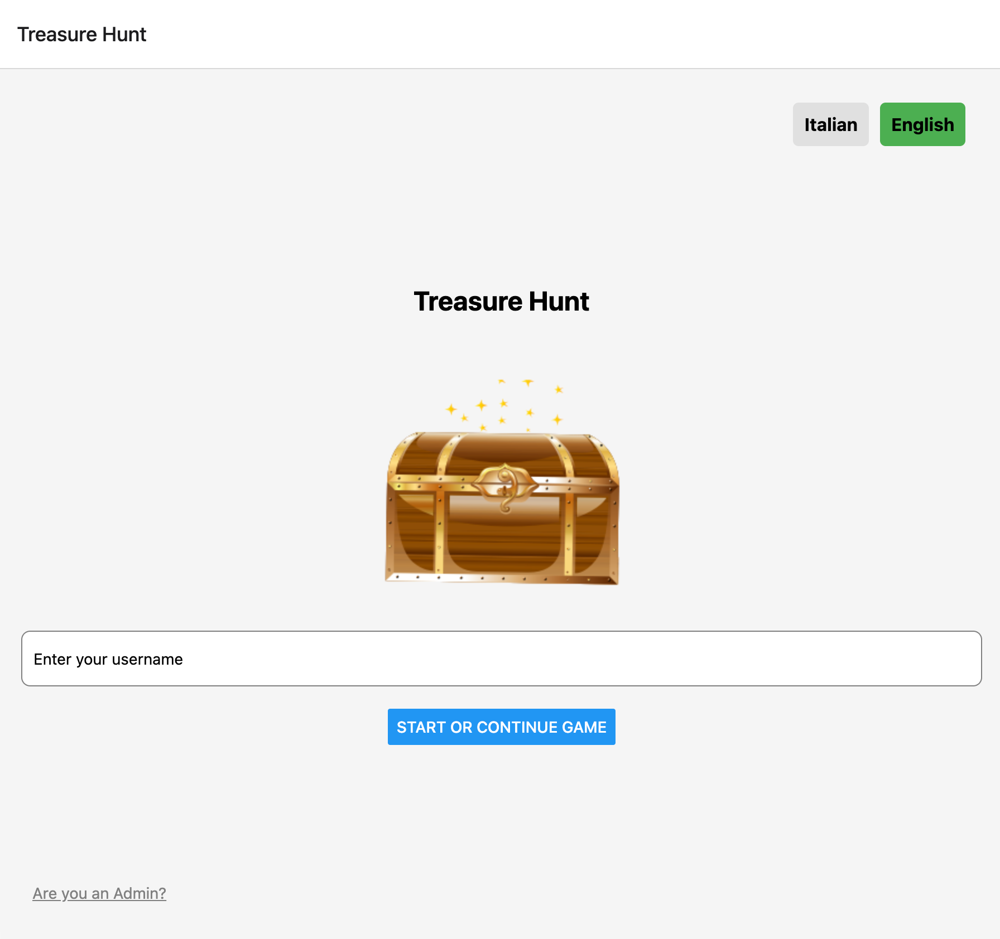

# Code Quest

Code Quest is a React Native mobile application built with Expo. It's a treasure hunt-style game where users register and answer questions to progress through a quest. The application also features an administration section for managing users and questions.

🌐 **Live Demo:** [code-quest-treasure-hunt.netlify.app](https://code-quest-treasure-hunt.netlify.app/register)



<!--
## Screenshots

### User Flow
| Register | Question | Success | End |
|:--------:|:--------:|:-------:|:---:|
|  |  |  |  |

### Admin Flow
| Admin Login | Dashboard | Manage Questions | View Users |
|:-----------:|:---------:|:----------------:|:----------:|
|  |  |  |  |
-->

## Features

- **User Registration:** Users can register to participate in the quest.
- **Quest Progression:** Users answer questions to move forward in the treasure hunt.
- **Admin Panel:** A separate section for administrators to manage the application.
- **User Management:** Admins can view a list of all registered users.
- **Question Management:** Admins can add, edit, and delete questions for the quest.
- **Internationalization:** The app supports multiple languages (English and Italian).

## Tech Stack

- **Core:** React Native, Expo
- **Navigation:** React Navigation (Stack Navigator)
- **Backend/Database:** Firebase
- **Localization:** i18next, react-i18next
- **Animation:** Lottie
- **Utilities:** expo-barcode-scanner for QR code scanning.

## Folder Structure

```
code-quest/
├── src/
│   ├── components/       # Reusable components
│   ├── config/           # Firebase configuration
│   ├── locales/          # Language files for internationalization
│   │   ├── en/
│   │   └── it/
│   ├── navigation/       # Navigation setup
│   └── screens/          # Application screens
├── assets/               # Images, fonts, and other static assets
├── .env.example          # Example environment variables
├── App.js                # Main application component
├── package.json          # Project dependencies and scripts
└── ...
```

## Getting Started

### Prerequisites

- Node.js
- npm or yarn
- Expo CLI

### Installation

1.  Clone the repository:
    ```bash
    git clone <repository-url>
    ```
2.  Navigate to the project directory:
    ```bash
    cd code-quest
    ```
3.  Install the dependencies:
    ```bash
    npm install
    ```
4.  Create a `.env` file and add your Firebase configuration. You can use `.env.example` as a template.

### Running the Application

To start the Expo development server, run:

```bash
npm start
```

This will open the Expo Developer Tools in your browser. You can then run the app on:

- An Android emulator or a physical device using the Expo Go app.
- An iOS simulator or a physical device using the Expo Go app.
- A web browser.

## Available Scripts

- `npm start`: Starts the Expo development server.
- `npm run android`: Runs the app on a connected Android device or emulator.
- `npm run ios`: Runs the app on an iOS simulator.
- `npm run web`: Runs the app in a web browser.

## Screens

### User Flow

- `RegisterScreen`: The initial screen where users can register for the quest.
- `QuestionScreen`: Displays the questions for the user to answer.
- `SuccessScreen`: Shown after a user provides a correct answer.
- `EndScreen`: The final screen displayed upon completion of the quest.

### Admin Flow

- `AdminLoginScreen`: The login screen for administrators.
- `AdminDashboardScreen`: The main dashboard for admin-related tasks.
- `ViewUsersScreen`: Allows admins to view all registered users.
- `ManageQuestionsScreen`: Allows admins to add, edit, or delete quest questions.

## Localization

The application uses `i18next` for internationalization. Supported languages are English (`en`) and Italian (`it`). Translation files can be found in the `src/locales/` directory.

## Contributors

Thanks to all the volunteers who contributed to this project! 🙏

|                  Contributor                   | Contribution                                                                                                                                |
| :--------------------------------------------: | :------------------------------------------------------------------------------------------------------------------------------------------ |
| [@MarcoCaamal](https://github.com/MarcoCaamal) | [Internationalization integration](https://github.com/MarcoCaamal/code-quest-treasure-hunt/commit/0dcf2e5eaf16c1b71d975fe13c6dc00eea429f5f) |

---

_This README was generated by an AI assistant._
